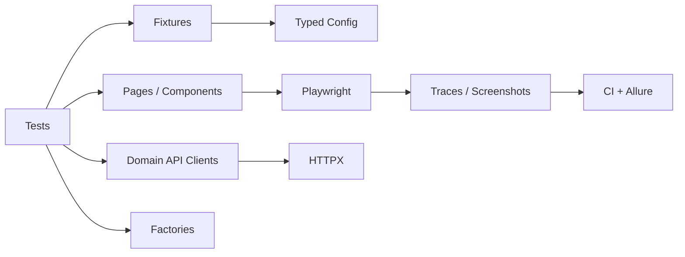

# Atlas Test Framework

A production-minded **QA automation framework reference implementation** for SDET, Software Engineer in Test and QA Framework Architecture portfolios. Atlas demonstrates how to structure test infrastructure so that tests stay readable while browser, API, configuration, diagnostics and CI concerns remain maintainable.

> This repository intentionally tests public demo endpoints. It is a framework showcase, not a test suite for those services.

## What this demonstrates

- Framework architecture rather than a collection of scripts
- Pytest fixture design and lifecycle management
- Playwright page/component abstractions and per-test isolation
- Reusable HTTP client and fluent response contract checks
- Typed multi-environment configuration with runtime overrides
- Deterministic test-data factories
- Failure diagnostics: screenshots and Playwright traces
- Layered suites: framework, API and E2E
- Parallel execution with `pytest-xdist`
- Allure-ready result generation
- CI quality gates, targeted jobs and nightly regression
- Dockerized execution and architecture decision records

## Architecture



See [docs/architecture.md](docs/architecture.md) for design principles and extension points.

## Repository layout

```text
atlas/                  framework package
  api/                  HTTP adapter + response assertions
  browser/              page/component foundations
  config/               typed settings + environment loader
  factories/            deterministic/unique test data
  reporting/            artifact naming and storage
tests/
  framework/            tests of the framework itself
  api/                  service-level examples
  e2e/                  browser examples
config/                  local/staging/CI configuration
docs/adr/                architecture decision records
.github/workflows/       PR and scheduled pipelines
```

## Quick start

Requires Python 3.12+.

```bash
python -m venv .venv
source .venv/bin/activate
pip install -e '.[dev]'
playwright install chromium
pytest tests/framework
pytest -m api
pytest -m e2e
```

Or run the smoke suite in Docker:

```bash
docker compose run --rm tests
```

## Environment strategy

Select a checked-in non-secret configuration:

```bash
ATLAS_ENV=staging pytest -m smoke
```

Override deployment-specific endpoints without changing source control:

```bash
ATLAS_API_BASE_URL=https://api.test.example \
ATLAS_WEB_BASE_URL=https://test.example \
pytest -m smoke
```

Secrets should be injected by CI or a secret manager, never committed to YAML.

## Test selection

```bash
pytest -m smoke
pytest -m api
pytest -m e2e
pytest -m 'regression and not e2e'
pytest -n auto
```

## Failure diagnostics

Every UI test receives an isolated browser context. On failure Atlas writes a full-page screenshot and Playwright trace under `artifacts/`. CI uploads these alongside Allure result files. This is deliberately conditional: passing tests do not create expensive traces.

## Why no blanket retries?

Retries can turn instability into apparently green pipelines. Atlas treats a first-run failure as a failure. See [ADR 004](docs/adr/004-retry-policy.md). A mature TestOps extension could rerun failures for classification while preserving the original quality-gate signal.

## CI strategy

Pull requests run three independent feedback paths:

1. **Quality:** Ruff, mypy and framework self-tests.
2. **API:** fast service-level checks with Allure results.
3. **E2E:** Chromium tests in parallel with failure artifacts.

A scheduled workflow demonstrates a separate regression cadence rather than forcing the entire suite onto every commit.

## Architecture decisions

- [ADR 001 — Playwright over Selenium](docs/adr/001-playwright-over-selenium.md)
- [ADR 002 — Browser context per test](docs/adr/002-test-isolation.md)
- [ADR 003 — Page/component model](docs/adr/003-page-component-model.md)
- [ADR 004 — Retry policy](docs/adr/004-retry-policy.md)

## Roadmap

The next portfolio-grade increments are contract testing, Testcontainers-backed integration tests, authenticated storage-state fixtures, flaky-test telemetry and changed-component test selection. Each belongs as a separate decision and measurable capability rather than another dependency added for appearance.

## Interview talking points

Use the repository to discuss why isolation beats cleanup-heavy shared state; why retries should diagnose rather than mask flakiness; where page objects become harmful; how test layers change feedback time; what should block a PR versus run nightly; and how traces/artifacts reduce mean time to diagnose failures.

## License

MIT. Replace `Your Name` in `pyproject.toml` and `LICENSE` before publishing.
