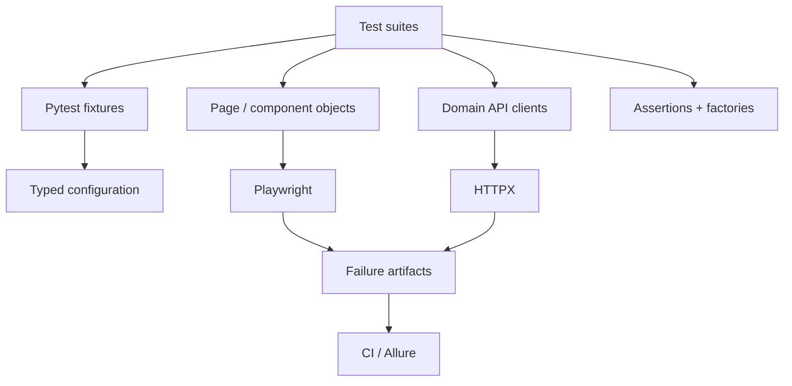

# Architecture

Atlas separates **test intent** from **transport and tooling details**. Tests consume stable fixtures, domain/page abstractions, factories and assertion helpers. Adapters isolate Playwright and HTTPX so application-specific clients and pages remain small.

## Design goals

- **Readable tests:** business intent should dominate test bodies.
- **Isolation:** each test owns browser context and generated data.
- **Observability:** failed UI tests retain screenshots and Playwright traces.
- **Replaceability:** tooling is behind small adapters instead of leaking everywhere.
- **Fast feedback:** framework tests, API tests and E2E tests can run independently.
- **CI first:** markers support targeted pull-request and scheduled suites.

## Extension points

Create application-specific API clients by composing `ApiClient`; create UI models by extending `BasePage` and `Component`; introduce factories per bounded domain; keep secrets outside YAML and override runtime endpoints with environment variables.
